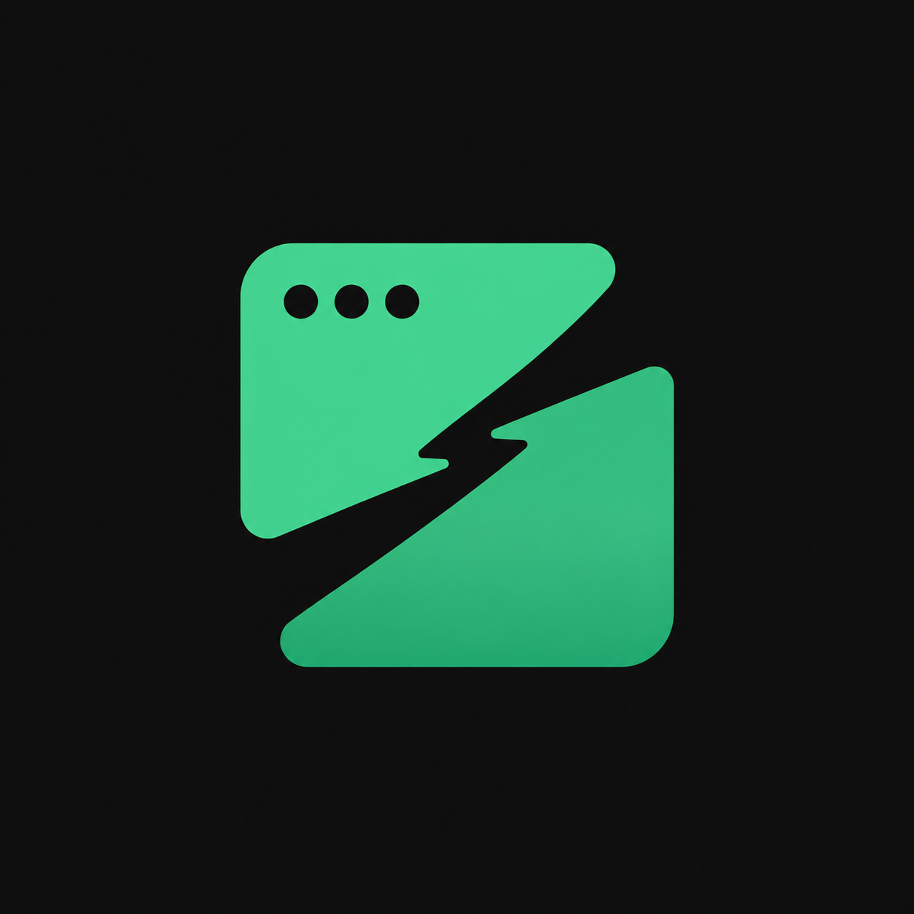
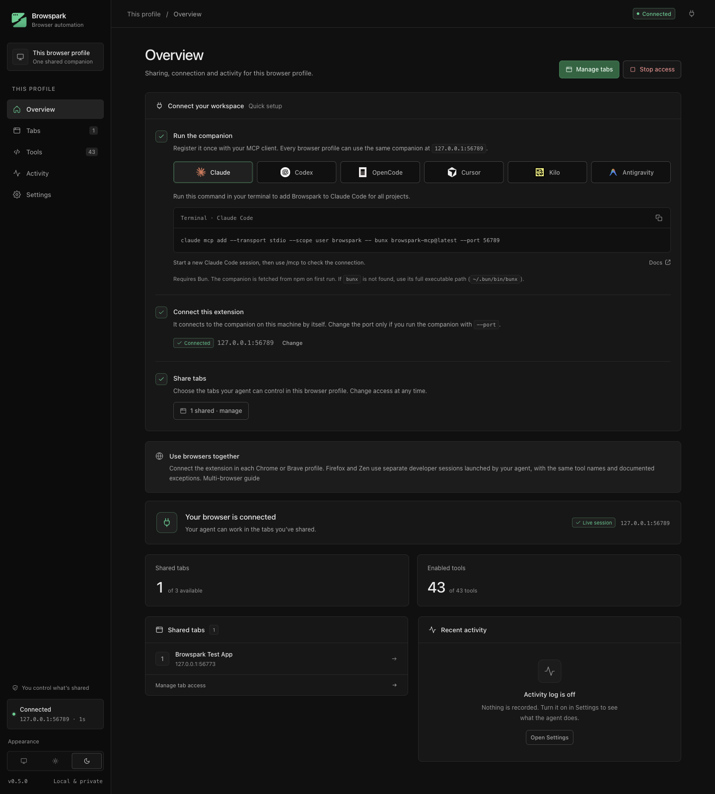

<div align="center">
    
    <h1>Browspark</h1>
    <p>
        Give your AI agent a real browser.
        <br>
        A local MCP server and Chrome extension for operating and debugging websites, with the full developer toolbox built in.
    </p>
    <a href="https://browspark.krishm.dev/">Website</a>
    ·
    <a href="https://docs.browspark.krishm.dev/">Documentation</a>
</div>

## Install
> [!NOTE]
> Browspark is in early release. If something breaks, please [open an issue](https://github.com/uncaughterrs/browspark/issues).

Requires [Bun](https://bun.sh) and a Chromium-based browser (Chrome, Brave, Edge).

**1. Register the companion** with your MCP client. It is published on npm as [`browspark-mcp`](https://www.npmjs.com/package/browspark-mcp); no clone needed.

```bash
claude mcp add browspark -- bunx browspark-mcp@latest
```

Codex, OpenCode, Cursor, Kilo, Antigravity and Gemini are covered in the [connect guide](https://docs.browspark.krishm.dev/connect/agents).

**2. Load the extension.** Clone this repo, run `bun install && bun run build`, then open `chrome://extensions`, turn on Developer mode, choose **Load unpacked** and select the `extension/` folder.

**3. Pair once.** Open the extension dashboard, ask the agent to call `browser_status`, paste the token it prints, and share the tabs the agent may use.

## What it does
- **Extension mode.** The agent drives tabs in your own browser, keeping your signed-in sessions. Only tabs you share are reachable, and you can revoke access instantly.
- **Developer mode.** The companion launches a separate Chrome with a persistent profile and talks CDP directly: every domain, raw commands, Lighthouse.
- **Developer tools as first-class tools.** Console, Network, Sources, Debugger, Elements, Performance, CPU and memory profiling, storage, service workers, coverage, emulation, accessibility, security, Lighthouse and a recorder that exports Playwright tests.

The full tool reference is at [docs.browspark.krishm.dev/tools](https://docs.browspark.krishm.dev/tools/overview).

<p align="center"></p>

## Development
```bash
bun install
bun run build            # extension bundles → extension/dist/
bun run typecheck
bun test                 # bridge unit tests
bun run test:e2e         # launches throwaway Chromes and runs the acceptance scenarios
bun run package          # dist/browspark-extension.zip
cd docs && bunx mint dev # preview the docs site
```

Layout: `companion/` (MCP server, transports, devtools modules), `extension/` (MV3 dashboard and worker), `shared/` (wire protocol), `docs/` (Mintlify site), `frontend/` (landing page), `test-apps/` (deterministic pages for tests).

## Contributing
Before contributing, please read the guidelines in [CONTRIBUTING.md](CONTRIBUTING.md).

## License
Browspark is licensed under the MIT License. See [LICENSE](LICENSE).
