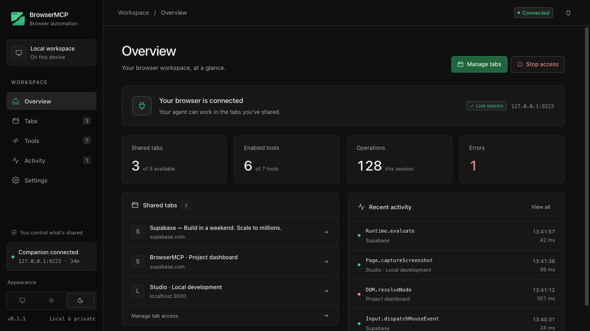

# BrowserMCP

Local MCP server that lets an AI agent operate websites and debug web applications in Chrome. Two connection modes:

- **Extension mode.** Drive tabs in your own Chrome, keeping their signed-in sessions. Only tabs you share from the extension dashboard are reachable.
- **Developer mode.** The companion launches Chrome with a dedicated persistent profile and talks CDP directly: every domain, raw commands, Lighthouse.

Developer tools are a first-class part of the product: Console, Network, Sources, Debugger, Elements, Performance, CPU and memory profiling, Application storage, service workers, coverage, emulation, accessibility, security, Lighthouse, and a recorder.

<p></p>

## Setup

```bash
bun install && bun run build
```

1. Load the extension: `chrome://extensions` → Developer mode → Load unpacked → the `extension/` folder. Or `bun run package` and load `dist/browsermcp-extension.zip` unpacked.
2. Register the companion with your MCP client. The dashboard's Overview setup includes instructions for Claude Code, Codex, OpenCode, Cursor, Kilo, and Antigravity. It runs straight from source on Bun.

```bash
claude mcp add browsermcp -- bun /absolute/path/to/browsermcp/companion/src/index.ts
```

For OpenCode, add to `opencode.json`:

```json
{ "mcp": { "browsermcp": { "type": "local", "command": ["bun", "/absolute/path/to/browsermcp/companion/src/index.ts"], "enabled": true } } }
```

For clients that take a URL instead of a command (Gemini connected apps, web agents), the companion also serves MCP over Streamable HTTP at `http://127.0.0.1:9223/mcp?token=<pairing token>` while it runs; the dashboard's Settings page shows the exact URL with a copy button. Start it standalone with `bun companion/src/index.ts --http-only` if no stdio client launches it. Sandboxed clients that cannot read the source tree (Gemini's command option) should use the URL, or run the single-file build from `bun run compile` (`dist/browsermcp`). The token is a password: never expose the endpoint beyond localhost without a tunnel that keeps it in the URL.

3. Pair once: click the extension icon to open the dashboard. Ask the agent to call `browser_status`; it prints a token. Paste it and click Connect.
4. Share tabs in the Tabs view, or switch on "Share everything" to include every current and future tab. Stop revokes access instantly.

Developer mode needs no pairing: the agent calls `browser_session {action:"launch"}`. Named contexts (`{context:"work"}`) are separate browsers with their own persistent profiles under `~/.browsermcp/profiles/`, and several can run at once; the default profile lives in `~/.browsermcp/profile` (override with `BROWSERMCP_PROFILE`). Each running context prints a CDP endpoint that Playwright or Puppeteer can `connectOverCDP` to, and a live-view URL (`http://127.0.0.1:9223/live/<tabId>?token=…`) that streams the tab into any browser with click-through control, useful for headless runs. Large exports go to `~/.browsermcp/artifacts` (`BROWSERMCP_ARTIFACTS`). The bridge port is `9223` (`--port`, `BROWSERMCP_PORT`).

## Tools

**Browser automation** (both modes)

| Tool | Purpose |
|---|---|
| `browser_status`, `browser_session`, `browser_tabs` | Connection state and pairing; launch/close named developer-browser contexts (parallel, persistent profiles, proxy, extra extensions); list/open/close/activate tabs |
| `browser_navigate`, `browser_wait`, `browser_dialog` | Navigation with load detection, waits, JavaScript dialogs |
| `browser_snapshot`, `browser_read`, `browser_extract` | Accessible tree with `[ref=eN]` handles (optionally as a diff), text/links/tables/html, structured extraction |
| `browser_click`, `browser_fill`, `browser_select`, `browser_key`, `browser_scroll`, `browser_upload` | Real input events; hover and drag via `browser_click`; file inputs |
| `browser_screenshot`, `browser_pdf`, `browser_batch` | Viewport, full-page, or element screenshots; print to PDF; several calls in one round trip |
| `browser_fetch` | Load a URL in a background tab and return its main content as markdown, text, or HTML, then close the tab |
| `browser_policy` | Allow or block domains for a tab, and by default for every tab the agent opens |
| `browser_download` | List downloads or wait for one and get its path |
| `browser_webmcp` | List and invoke tools a page exposes through WebMCP (`navigator.modelContext`) |

**Developer tools** (both modes unless noted; see [docs/capabilities.md](docs/capabilities.md))

| Tool | Purpose |
|---|---|
| `devtools_session`, `devtools_events`, `devtools_capabilities`, `devtools_cdp` | Start/stop collection per tab (with cleanup), read or wait for events, probe supported domains, raw CDP (developer mode) |
| `devtools_console`, `devtools_evaluate` | Search logs/exceptions with stacks, inspect logged objects, evaluate in page, frame, or paused call frame |
| `devtools_network` | Search by URL/headers/body, inspect timing and initiators, bodies, WebSocket/SSE frames, HAR export, throttling, cache, blocking, mocks, replay |
| `devtools_sources`, `devtools_debugger` | List/get/search scripts, stylesheets, documents; source maps; resource overrides; breakpoints (line, conditional, logpoint, exception, DOM, event, XHR), stepping, stacks, scopes, watches, variable edits, blackboxing |
| `devtools_elements` | DOM search returning refs, HTML/attribute/class edits, matched and computed styles, box model, event listeners, forced pseudo states, overlays |
| `devtools_performance`, `devtools_profile`, `devtools_memory`, `devtools_coverage` | Traces with long-task and category summaries, Web Vitals; CPU profiles with bottom-up and call tree; heap snapshots, class diffs, retainers, allocation sampling, growth checks; JS/CSS coverage |
| `devtools_storage`, `devtools_workers` | Cookies, local/session storage, IndexedDB, Cache Storage, usage, targeted clearing; service worker lifecycle, bypass, manifest, in-worker evaluation |
| `devtools_emulation`, `devtools_accessibility`, `devtools_security` | Devices, CPU/network throttling, geolocation, media features, locale, vision, animations; accessibility tree, quick audit, Chrome-reported issues; certificate and mixed content |
| `devtools_lighthouse` | Official Lighthouse CLI against the developer browser, with HTML/JSON reports (developer mode) |
| `devtools_recorder` | Record browser actions with stable selectors, parameterize, add assertions and checkpoints, replay and stop at failures, export as a Playwright test |

Exports use Chrome's own formats: `.json` traces (DevTools Performance, Perfetto), `.cpuprofile`, `.heapsnapshot`, `.heapprofile`, `.har`, Lighthouse HTML.

## Notes on behavior

- Chrome shows a "BrowserMCP started debugging this browser" bar on shared tabs. It is Chromium's own notice for the debugger API and cannot be suppressed by the extension. Launch the browser with `--silent-debugger-extension-api` to hide it (`open -a "Brave Browser" --args --silent-debugger-extension-api` on macOS, after quitting it), or use developer mode, which has no bar.
- Chrome does not let extensions or CDP drive the DevTools window (open it, toggle the device toolbar, pick a panel). The agent's tools send the same protocol commands DevTools' panels send. To watch in the standard UI, open DevTools on the tab yourself in extension mode, or launch developer mode, which opens DevTools on every tab by default; both coexist with the agent.
- Shared tabs from all Chrome windows are available. Select a `tabId` from `browser_tabs`; without one, tools use the agent's own usable tab or the only usable tab, and require an explicit choice when ambiguous. Tabs the agent opens are ordinary Chrome tabs, shared automatically, and become that agent's default target.
- The debugger (and the bar) attaches when the agent sends a command and detaches after 30 seconds without one, unless a `devtools_session` is running on that tab. Tune with `idleDetachMs` in the extension's storage.
- Input and screenshots need a rendered tab, so the extension activates the target tab within its window first.
- Refs point at live nodes; a ref whose node left the DOM reports as stale. Re-snapshot after navigation.
- A click that opens a dialog or hits a breakpoint returns immediately and tells you what to do next.
- `devtools_session stop` removes every breakpoint, mock, override, blocked URL, and emulation the session set.
- Raw traces can include browser-wide activity; they are not strictly per tab.
- Chrome refuses `chrome://`, extension, and Web Store pages, and does not expose some domains to extensions. Those show up as unsupported instead of silently switching browsers.

## Development

```bash
bun run typecheck
bun test                 # bridge unit tests
bun run test:e2e         # launches throwaway Chromes and runs every plan.md acceptance scenario
E2E_LIGHTHOUSE=1 bun run test:e2e   # also runs a real Lighthouse audit
bun run capabilities     # regenerates docs/capabilities.md from live probes
bun run package          # dist/browsermcp-extension.zip
```

Layout: `companion/` (MCP server, transports, devtools modules), `extension/` (MV3 dashboard and worker), `shared/` (wire protocol), `test-apps/` (deterministic pages, API, service worker, source-mapped script).
