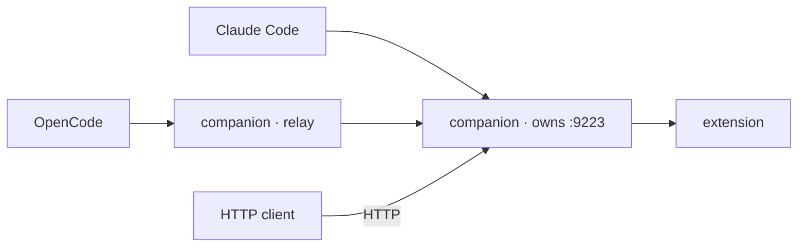

You can connect as many agents as you like. They share one companion, one extension and one set of shared tabs, while each keeps its own tabs and recordings.

## One companion, many clients

The first companion process to start owns port `9223`. Every companion started afterwards, by any other client, finds the port taken and becomes a **relay**: a thin stdio server that forwards `tools/list` and `tools/call` to the owner over the HTTP endpoint. From the client's point of view nothing changes; from the extension's point of view there is still exactly one connection.



The relay passes the downstream client's name through, so the owner still knows which agent is calling. Stopping the owner ends the relays too; the next client to start becomes the new owner.

<Note>
If the port is taken by something that is not a companion, the relay's handshake fails and the process exits with a message asking you to stop the other process or use `--port`. It never guesses a different port on its own, because the extension is configured for one specific port.
</Note>

## What is per agent

| Per agent | Shared by all agents |
|---|---|
| Tabs the agent opened with `browser_tabs` or `browser_fetch`, which become that agent's default target | Tabs you shared from the dashboard |
| Recorder flows in progress | Developer-browser contexts |
| Agent name in the activity log and tab list | Inspection sessions (`devtools_session`) on a tab: the session stays alive until the last agent using it stops |
| The MCP server instance and its tool list | The tool policy from the dashboard |

When two agents both leave `tabId` empty, each gets its own most recently opened tab. If neither owns a tab and several tabs are shared, the tool asks for an explicit `tabId` rather than guessing.

## Verifying

```bash
lsof -nP -iTCP:9223 -sTCP:LISTEN
```

shows exactly one `bun` process listening. `pgrep -fl browspark-mcp` shows one owner plus one relay per additional stdio client. The dashboard's Activity page (when the log is on) lists which agent issued each command.
