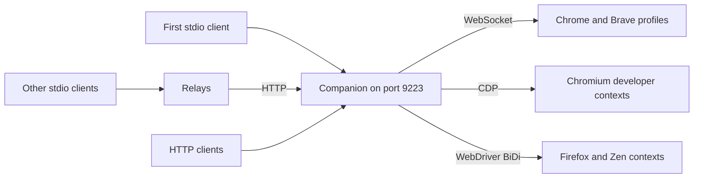

You can connect as many agents as you like. They share one companion and access to its connected browser profiles and developer contexts, while each keeps its own tab ownership and recordings. Chrome and Brave extensions can connect together; Firefox and Zen use separate developer contexts. See [Using multiple browsers](/reference/multiple-browsers).

## One companion, many clients

The first companion process to start owns port `9223`. Every companion started afterwards, by any other client, finds the port taken and becomes a **relay**: a thin stdio server that forwards `tools/list` and `tools/call` to the owner over the HTTP endpoint. From the client's point of view nothing changes. Each extension profile connects once to that owner, regardless of how many agents are using it.



The relay passes the downstream client's name through, so the owner still knows which agent is calling. When the owner stops (its client quit or it was killed), the first relay to notice takes the port over and keeps serving its own client; the other relays reconnect to it on their next call, and each extension reconnects on its own. Inspection sessions and developer browsers of the old owner do not survive the hand-over. Call `browser_status` again to get current browser and tab IDs.

<Note>
If the port is taken by something that is not a companion, the relay retries for a few seconds and then answers every tool call with an error asking you to stop the other process or use `--port`. It never guesses a different port on its own, because the extension is configured for one specific port.
</Note>

## What is per agent

| Per agent | Shared by all agents |
|---|---|
| Tabs the agent opened with `browser_tabs` or `browser_fetch`, which become that agent's default target | Tabs you shared from the dashboard |
| Recorder flows in progress | Developer-browser contexts |
| Agent name in the activity log and tab list | Inspection sessions (`devtools_session`) on a tab: the session stays alive until the last agent using it stops |
| The MCP server instance and its tool list | Tool policies from the connected dashboards, applied to the selected browser or combined for global/developer calls |

When two agents both leave `tabId` empty, each gets its own most recently opened tab. If neither owns a tab and several tabs are shared, the tool asks for an explicit `tabId` rather than guessing.

When working across browsers, pass the returned `tabId` explicitly on page tools. Use `browserId` to open a tab in an extension browser and `context` to open one in a developer session. Tab ownership chooses a default target; it does not prevent another agent from using an accessible tab by ID.

## Verifying

```bash
lsof -nP -iTCP:9223 -sTCP:LISTEN
```

shows exactly one `bun` process listening. `pgrep -fl browspark-mcp` shows one owner plus one relay per additional stdio client. Each dashboard's Activity page (when the log is on) lists which agent issued commands to that profile.
