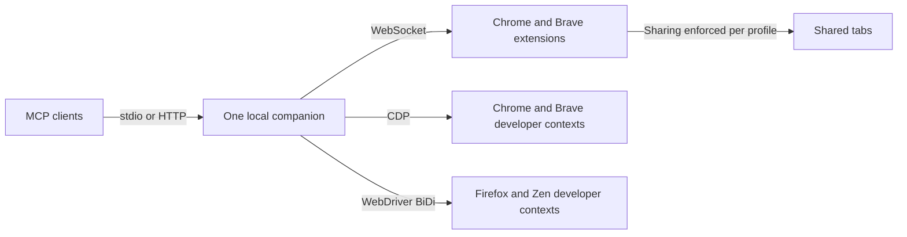

## The pieces

- **Companion** (`companion/`): the MCP server. Registers 43 tools, keeps per-tab capture state (console, network, scripts, paused frames, issues), holds artifacts, and routes each command to the selected extension or developer browser. Connected browsers share one local port and have unique public tab IDs.
- **Extension** (`extension/`): a Manifest V3 service worker that connects each Chrome or Brave profile to the companion and attaches the browser's debugger to shared tabs, plus the full-page dashboard where you share tabs, switch tools on and off, and read the activity log. Several profiles can connect simultaneously.
- **Shared protocol** (`shared/protocol.ts`): the typed request, response and event messages between the two. Summarised in [Wire protocol](/reference/wire-protocol).

## One tool call, end to end

1. The agent calls `browser_click {tabId: 1234, ref: "e12"}`.
2. The companion checks the tool is not [disabled in the dashboard](/concepts/tool-policy), resolves the tab (the caller's own tab, the only usable tab, or the explicit `tabId`) and looks up ref `e12` in the snapshot registry the page keeps in `window.__bmcp`.
3. Because tab 1234 is an extension-mode tab, the companion selects its owning browser, translates the public tab ID to that browser's native ID, and sends a `cdp` request over its WebSocket: method `Input.dispatchMouseEvent` with the coordinates.
4. The service worker checks sharing, attaches the debugger if it is not attached yet, forwards the command, and returns the result. Background Mode keeps the tab in the background by default; a profile can opt into foreground input in Settings.
5. While waiting, the companion also listens for `Page.javascriptDialogOpening` and `Debugger.paused`. If a dialog or breakpoint interrupts the click, the call returns immediately and says what to do next instead of hanging.
6. After 30 seconds without commands the worker detaches the debugger and the yellow bar disappears, unless a `devtools_session` is holding the tab.

## Developer mode

When a tool needs something Chromium does not expose to extensions, for example a heap snapshot, it fails with a message saying so. `browser_session {action: "launch", browser: "chrome"}` starts a separate Chrome with `--remote-debugging-port=0`, reads its `DevToolsActivePort` file, and talks to it directly. Brave uses the same CDP transport. These tabs belong to the agent's developer context and DevTools opens on each one by default.

Firefox and Zen developer sessions use WebDriver BiDi with the same tool names and [documented exceptions](/reference/firefox). They do not attach to everyday Firefox or Zen tabs. Name each context to run several browsers together, then select a `context` for new developer tabs or a `tabId` for an existing tab. The connected dashboards' **Developer browser** settings control whether launches are allowed. Details in [Developer browser](/concepts/developer-browser) and [Using multiple browsers](/reference/multiple-browsers).

## State and files

Everything persistent lives under `~/.browspark/`:

| Path | Contents |
|---|---|
| `tools.json` | Tools disabled from the dashboard, applied on every companion start. |
| `profile/`, `profiles/<name>/` | Persistent Chrome/Chromium profiles of developer contexts. |
| `profiles/.brave/<name>/`, `profiles/.firefox/<name>/`, `profiles/.zen/<name>/` | Persistent profiles for the other browser choices. |
| `downloads/` | Downloads made in developer contexts; `browser_status` gives the context's directory. |
| `artifacts/` | Traces, CPU and heap profiles, HAR, PDFs, Lighthouse reports, recorder flows. |

See [Files and directories](/reference/files-and-directories).
