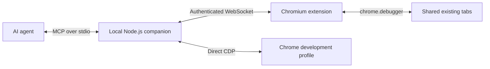

# Chromium Browser MCP — Automation and Developer Tools

## 1. Summary

Build a local, open-source MCP tool that lets an AI agent both operate websites and debug web applications.

**Developer tools are a committed part of the product**, covering Console, Network, Sources, Elements, Performance, Memory, Application, and related debugging features.

Support two connection modes:

- **Extension mode:** Control explicitly shared tabs in your existing browser, retaining their signed-in sessions.
- **Full developer mode:** The local companion launches Chrome with a separate development profile and connects directly through CDP for broader debugging capabilities.

“Sources” means Chrome’s Sources panel. Git operations are outside this project.

## 2. Architecture and interfaces

Use TypeScript, the official MCP SDK, and a simple extension popup. Share browser-operation implementations across both connections through the same CDP command/event interface.

The extension declares its debugger permission at installation. Chrome restricts the CDP domains exposed through extensions, so capability reporting must distinguish extension support from direct CDP support. [Chrome debugger API](https://developer.chrome.com/docs/extensions/reference/api/debugger)

Developer mode uses a dedicated persistent profile, with its own login sessions. Keep its debugging endpoint local and manage only the Chrome instance launched by the companion. Chrome requires a nondefault profile when launched with remote debugging switches. [Chrome debugging requirements](https://developer.chrome.com/blog/remote-debugging-port)

Add these common interfaces:

| Interface | Purpose |
|---|---|
| `browser_session` | Connect, launch a development browser, inspect status, and disconnect. |
| `devtools_capabilities` | Report available tools, browser version, connection mode, and unsupported operations. |
| `devtools_session` | Start/stop inspection and configure collection for a selected tab. |
| `devtools_events` | Read or wait for console messages, requests, exceptions, breakpoint hits, and recording completion. |
| `devtools_cdp` | Execute additional supported CDP commands in full developer mode, with explicit target and validated arguments. |

Page operations require an explicit session and tab. Extension mode enforces shared-tab access. Browser-wide operations, including some profiling and storage operations, are scoped to the dedicated development browser.

## 3. Core browser automation

| Feature | MCP tools |
|---|---|
| Connection and tab management | `browser_status`, `browser_tabs` |
| Navigate, reload, back, forward | `browser_navigate` |
| Accessible page snapshot and element references | `browser_snapshot` |
| Read text, links, and tables | `browser_read` |
| Click, fill fields, choose options | `browser_click`, `browser_fill`, `browser_select` |
| Keyboard input and scrolling | `browser_key`, `browser_scroll` |
| Viewport screenshots | `browser_screenshot` |
| Wait for text, URLs, or element states | `browser_wait` |
| Accept or dismiss JavaScript dialogs | `browser_dialog` |

The popup provides pairing, tab sharing, connection status, recent operation results, and a stop button.

Keep frame-aware element references, reject stale targets, handle cross-origin frames, and report unsupported browser pages clearly. Reconnect after interruptions without automatically repeating actions.

## 4. Advanced features — committed developer suite

### Console inspection and searches

Provide `devtools_console` and `devtools_evaluate` to:

- Capture logs, warnings, errors, exceptions, and stack traces.
- Search by text or regex; filter by severity, source URL, frame, and time.
- Inspect logged objects and their properties.
- Preserve collected logs across reloads, clear them, and wait for matching messages.
- Evaluate JavaScript in a selected page/frame context and return values or exceptions.

Use Runtime and Log events as the data source. Evaluation runs in the inspected application context. [CDP Runtime](https://chromedevtools.github.io/devtools-protocol/tot/Runtime/)

### Network inspection and searches

Provide `devtools_network` to:

- Record requests, responses, redirects, failures, timing, size, and initiator stacks.
- Search URLs, headers, request payloads, and captured response bodies.
- Filter by method, status, domain, resource type, duration, and text/regex.
- Inspect individual requests, JSON responses, WebSocket messages, and server-sent events.
- Preserve recordings across reloads and export HAR.
- Disable cache, emulate offline/slow connections, and block matching requests.
- Replay supported requests explicitly and apply request/response overrides or mocks.

Body searches cover captured content; results must identify missing, evicted, or truncated bodies. Interception uses bounded rules and releases paused requests when inspection stops. [CDP Network](https://chromedevtools.github.io/devtools-protocol/tot/Network/), [CDP Fetch](https://chromedevtools.github.io/devtools-protocol/tot/Fetch/)

### Sources inspection and JavaScript debugging

Provide `devtools_sources` and `devtools_debugger` to:

- List and retrieve loaded scripts, stylesheets, and document resources.
- Search across sources by filename, text, or regex, returning line locations.
- Resolve source maps when available and map generated code to original sources.
- Set, disable, and remove line, conditional, exception, DOM, event-listener, and XHR/fetch breakpoints.
- Pause, resume, step into/over/out, and continue to a location.
- Inspect synchronous/asynchronous call stacks, scopes, variables, and watch expressions.
- Evaluate expressions while paused and modify supported variable values.
- Select frame/worker contexts and ignore library scripts during stepping.
- Apply temporary resource overrides, reload, inspect changes, and revert them.

Use resource overrides for JavaScript changes. Current CDP documentation marks live script editing as unavailable; it must not be the editing foundation. Repository edits remain with the coding agent’s normal file tools. [CDP Debugger](https://chromedevtools.github.io/devtools-protocol/tot/Debugger/)

### Remaining developer tool coverage

| Area | Features to implement |
|---|---|
| **Elements and CSS** | Search DOM nodes; inspect/edit HTML, attributes, styles, and classes; read computed styles and box models; inspect event listeners; force pseudo-states; highlight elements and layout overlays. |
| **Performance** | Start/stop recordings; search trace events; inspect long tasks, scripting, rendering, layout, paint, and network costs; report observed Web Vitals; compare recordings and export traces. |
| **CPU profiling** | Capture sampling profiles; identify expensive functions; return call-tree and bottom-up summaries; export profiles. |
| **Memory** | Capture heap snapshots and allocation profiles; compare snapshots; inspect retained objects, detached nodes, and memory growth; export `.heapsnapshot` files. |
| **Application and storage** | Inspect/edit cookies, local/session storage, IndexedDB, and Cache Storage; inspect storage usage; clear explicitly targeted application data. |
| **Service workers and PWA** | Inspect registrations and worker state; inspect worker execution; update/unregister workers; bypass service workers; inspect web app manifests. |
| **Coverage** | Record JavaScript/CSS coverage and locate unused code by file and range. |
| **Device emulation and rendering** | Change viewport, device scale, touch, user agent, CPU/network throttling, geolocation, color scheme, and reduced motion; inspect animation/rendering behavior. |
| **Accessibility and issues** | Inspect accessibility trees, names, roles, and states; retrieve browser-reported issues and relevant DOM locations. |
| **Security inspection** | Inspect certificate/connection details, mixed content, and browser-reported security issues. |
| **Lighthouse audits** | Run the official Lighthouse tooling through the companion and return findings plus HTML/JSON reports. |
| **Recorder and testing** | Record/replay browser actions, parameterize flows, add assertions, and stop at failures or checkpoints. |
| **Additional CDP capabilities** | Expose supported Animation, Media, WebAudio, WebAuthn, and other domains through the developer-mode CDP interface and event reader. |

Profiling uses Chrome’s trace/profile formats so exported recordings can also be opened in existing analysis tools. Lighthouse is a separate companion integration. [Tracing](https://chromedevtools.github.io/devtools-protocol/tot/Tracing/), [Heap profiling](https://chromedevtools.github.io/devtools-protocol/tot/HeapProfiler/), [Lighthouse](https://developer.chrome.com/docs/lighthouse/overview)

Shared implementation requirements:

- Collect console/network metadata while a developer inspection session is active; enable body capture and profiling when requested.
- Support paginated, bounded searches and report collection start time and dropped records.
- Return concise structured results with identifiers for deeper inspection. Store large traces, profiles, and exports as local artifacts.
- Serialize conflicting recordings, but allow debugger resume/cancel commands to interrupt waiting operations.
- Remove session-owned breakpoints, interception rules, and emulation overrides during cleanup.
- Report native DevTools attachment conflicts and capability differences without silently changing browsers.
- Treat raw traces as potentially containing browser-wide activity; do not claim strict per-tab isolation.

Retain the earlier automation backlog: richer interactions, compact snapshot differences, full-page/element screenshots, structured extraction, file uploads/downloads, batching, a persistent side panel, multiple-client coordination, and packaged distribution.

## 5. Delivery and acceptance

Deliver in this order:

1. **Foundation and browser automation:** Pairing, selected tabs, core tools, reconnection, and access enforcement.
2. **Everyday web debugging:** Console/network searches, Elements/CSS, Sources search, breakpoints, stepping, and evaluation.
3. **Full developer mode:** Dedicated Chrome profile, performance/CPU/memory tools, application storage, workers, coverage, emulation, audits, and additional CDP access.
4. **Workflow and release polish:** Recording/replay, exports, richer automation, documentation, and distribution.

Developer coverage is complete only after these reproducible scenarios pass:

- Find a console error and connect its stack trace to the relevant source.
- Find a failing API request by URL/status, inspect its payload and response, and test a mocked response.
- Search a source-mapped application, set a breakpoint in original code, inspect variables, and step through execution.
- Apply a resource override, reload, verify the result, and revert it.
- Identify a deliberately slow function through a CPU profile and performance recording.
- Detect retained objects in a controlled memory-growth example and export a usable heap snapshot.
- Inspect/edit application storage and exercise a service-worker update.
- Change CSS, verify computed layout, and test mobile viewport behavior.
- Export artifacts that open successfully in Chrome DevTools or Lighthouse viewers.
- Handle disconnects, revoked access, unavailable capabilities, and competing debugger sessions without duplicated actions or stuck requests.

Use Node’s built-in test runner for bridge logic and a small browser integration suite with deterministic test applications. Document a tested capability matrix for both connection modes.
